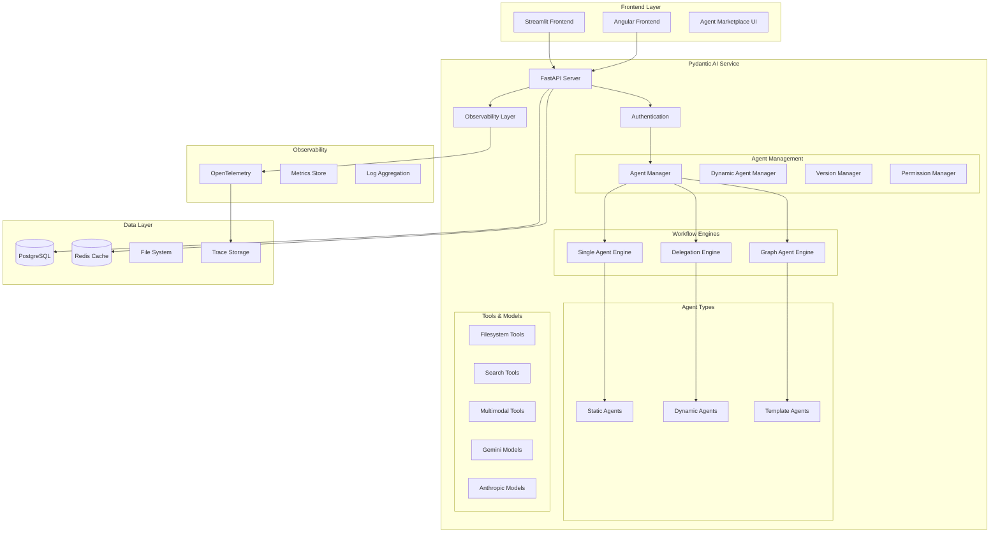
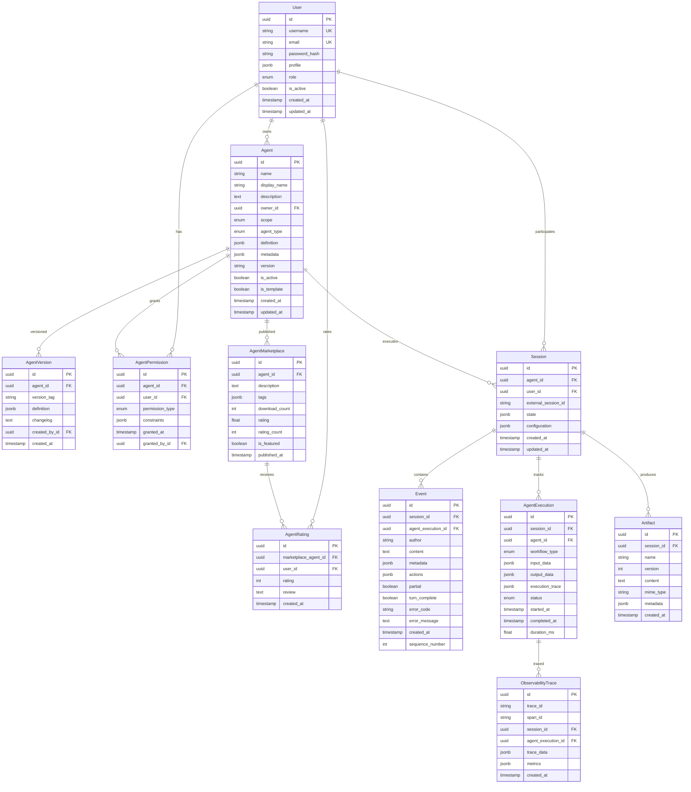

# Pydantic AI Agents Service - Implementation Plan

## 🏗️ Enhanced Architecture Overview



## 🗄️ Enhanced Database Schema



## 📁 Enhanced Project Structure

```
apps/backends/pydantic_ai/
├── pyproject.toml              # UV workspace dependencies
├── Dockerfile                  
├── .dockerignore
├── alembic.ini                
├── main.py                     
├── src/
│   ├── __init__.py
│   ├── api/                    # FastAPI routes
│   │   ├── __init__.py
│   │   ├── main.py             
│   │   ├── deps.py             
│   │   ├── middleware.py       
│   │   └── routes/
│   │       ├── __init__.py
│   │       ├── auth.py         # Authentication
│   │       ├── users.py        # User management
│   │       ├── agents.py       # Agent CRUD & execution
│   │       ├── sessions.py     # Session management
│   │       ├── marketplace.py  # Agent marketplace
│   │       ├── observability.py # Metrics & traces
│   │       ├── compatibility.py # ADK compatibility
│   │       └── health.py       
│   ├── agents/                 # Agent system
│   │   ├── __init__.py
│   │   ├── base/               # Base classes
│   │   │   ├── __init__.py
│   │   │   ├── agent.py        # Base agent interface
│   │   │   ├── workflow.py     # Workflow base classes
│   │   │   └── registry.py     # Agent registry
│   │   ├── static/             # Static (code-based) agents
│   │   │   ├── __init__.py
│   │   │   ├── main_agent.py   
│   │   │   ├── research_agent.py
│   │   │   └── developer_agent.py
│   │   ├── dynamic/            # Dynamic agent system
│   │   │   ├── __init__.py
│   │   │   ├── factory.py      # Dynamic agent creation
│   │   │   ├── loader.py       # Runtime agent loading
│   │   │   ├── validator.py    # Agent definition validation
│   │   │   └── templates.py    # Agent templates
│   │   ├── workflows/          # Workflow engines
│   │   │   ├── __init__.py
│   │   │   ├── single.py       # Single agent workflows
│   │   │   ├── delegation.py   # Agent delegation
│   │   │   └── graph.py        # Graph-based workflows
│   │   └── manager.py          # Agent orchestration
│   ├── tools/                  # Agent tools
│   │   ├── __init__.py
│   │   ├── base.py            
│   │   ├── registry.py         # Tool registry
│   │   ├── filesystem/        
│   │   │   ├── __init__.py
│   │   │   ├── read_write.py
│   │   │   ├── search.py       # grep, find functionality
│   │   │   └── diff.py
│   │   ├── search/            
│   │   │   ├── __init__.py
│   │   │   ├── web_search.py   # Google/Bing search
│   │   │   └── knowledge.py    # Knowledge retrieval
│   │   ├── multimodal/        
│   │   │   ├── __init__.py
│   │   │   ├── image.py
│   │   │   └── document.py
│   │   └── custom/             # User-defined tools
│   ├── models/                 # Database models
│   │   ├── __init__.py
│   │   ├── base.py            
│   │   ├── user.py             # User model
│   │   ├── agent.py            # Agent models
│   │   ├── session.py         
│   │   ├── event.py           
│   │   ├── execution.py        # Execution tracking
│   │   ├── marketplace.py      # Marketplace models
│   │   ├── observability.py    # Observability models
│   │   └── artifact.py        
│   ├── schemas/               
│   │   ├── __init__.py
│   │   ├── auth.py             # Auth schemas
│   │   ├── users.py            # User schemas
│   │   ├── agents.py           # Agent schemas
│   │   ├── workflows.py        # Workflow schemas
│   │   ├── marketplace.py      # Marketplace schemas
│   │   ├── requests.py        
│   │   ├── responses.py       
│   │   └── compatibility.py   
│   ├── services/              
│   │   ├── __init__.py
│   │   ├── auth_service.py     # Authentication service
│   │   ├── user_service.py     # User management
│   │   ├── agent_service.py    # Agent orchestration
│   │   ├── dynamic_agent_service.py # Dynamic agents
│   │   ├── workflow_service.py # Workflow execution
│   │   ├── marketplace_service.py # Marketplace
│   │   ├── session_service.py 
│   │   ├── model_service.py   
│   │   ├── observability_service.py # Observability
│   │   └── stream_service.py  
│   ├── core/                  
│   │   ├── __init__.py
│   │   ├── config.py          
│   │   ├── database.py        
│   │   ├── cache.py            # Redis integration
│   │   ├── security.py        
│   │   ├── permissions.py      # Permission system
│   │   ├── observability.py    # OpenTelemetry setup
│   │   └── logging.py         
│   └── utils/                 
│       ├── __init__.py
│       ├── converters.py      
│       ├── validators.py      
│       ├── serializers.py      # Agent definition serialization
│       └── metrics.py          # Custom metrics
├── migrations/                
├── templates/                  # Agent templates
│   ├── basic_agent.yaml
│   ├── research_agent.yaml
│   ├── developer_agent.yaml
│   └── custom_workflow.yaml
└── tests/                     
    ├── __init__.py
    ├── conftest.py
    ├── test_agents.py
    ├── test_dynamic_agents.py
    ├── test_workflows.py
    ├── test_marketplace.py
    ├── test_observability.py
    └── test_api.py
```

## 🤖 Enhanced Agent System

### Dynamic Agent Definition Format
```yaml
name: "custom_research_agent"
display_name: "Custom Research Agent"
description: "A specialized research agent for academic papers"
version: "1.0.0"
type: "single" # single, delegation, graph
scope: "user" # user, system, marketplace

model:
  provider: "vertex-gemini"
  model: "gemini-1.5-pro"
  temperature: 0.1

system_prompt: |
  You are a specialized research agent focused on academic literature.
  You have access to search tools and can provide detailed analysis.

tools:
  - name: "web_search"
    enabled: true
    config:
      max_results: 10
  - name: "document_analyzer"
    enabled: true

workflows:
  research_paper:
    steps:
      - tool: "web_search"
        query: "{{user_query}} academic papers"
      - tool: "document_analyzer"
        input: "{{search_results}}"

permissions:
  public: false
  shared_with: []
  
metadata:
  tags: ["research", "academic", "papers"]
  category: "research"
```

### Agent Factory Implementation
```python
@dataclass
class AgentFactory:
    """Factory for creating dynamic agents at runtime"""
    
    async def create_agent(
        self, 
        definition: AgentDefinition,
        user_id: UUID,
        db: AsyncSession
    ) -> Agent:
        """Create a Pydantic AI agent from definition"""
        
        # Validate definition
        validated_def = self.validator.validate(definition)
        
        # Create model provider
        model = self.model_service.create_model(
            validated_def.model.provider,
            validated_def.model.model
        )
        
        # Create tools
        tools = []
        for tool_def in validated_def.tools:
            tool = self.tool_registry.get_tool(tool_def.name)
            tools.append(tool.configure(tool_def.config))
        
        # Create agent
        agent = Agent(
            model=model,
            system_prompt=validated_def.system_prompt,
            tools=tools,
            deps_type=DynamicAgentDeps
        )
        
        # Store in database
        await self.store_agent(validated_def, user_id, db)
        
        return agent
```

### Workflow Engine Support
```python
class WorkflowEngine:
    """Supports multiple workflow patterns"""
    
    async def execute_single_agent(
        self, 
        agent: Agent, 
        input_data: str,
        context: ExecutionContext
    ) -> ExecutionResult:
        """Single agent execution"""
        
    async def execute_delegation(
        self, 
        main_agent: Agent,
        sub_agents: List[Agent],
        input_data: str,
        context: ExecutionContext
    ) -> ExecutionResult:
        """Agent delegation pattern"""
        
    async def execute_graph(
        self, 
        workflow_graph: WorkflowGraph,
        input_data: str,
        context: ExecutionContext
    ) -> ExecutionResult:
        """Graph-based agent workflows"""
```

## 🛒 Simple Agent Marketplace

### Core Marketplace Features
1. **Publishing**: Users can publish their agents publicly
2. **Browsing**: Browse agents by tags, categories, and search terms
3. **Downloading**: Clone/download agents to personal workspace
4. **Rating**: Simple 1-5 star rating system
5. **Discovery**: Featured agents and trending agents

### Marketplace API Design
```python
# Marketplace endpoints
GET /marketplace/agents?search=&tags=&category=&sort=rating
POST /marketplace/agents/{agent_id}/publish
POST /marketplace/agents/{agent_id}/download
POST /marketplace/agents/{agent_id}/rate
GET /marketplace/agents/{agent_id}/stats
```

### Marketplace Service Implementation
```python
class MarketplaceService:
    """Simple agent marketplace service"""
    
    async def publish_agent(
        self, 
        agent_id: UUID, 
        user_id: UUID,
        db: AsyncSession
    ) -> MarketplaceAgent:
        """Publish an agent to the marketplace"""
        
    async def search_agents(
        self,
        search_terms: Optional[str] = None,
        tags: List[str] = [],
        category: Optional[str] = None,
        sort_by: str = "rating",
        db: AsyncSession = None
    ) -> List[MarketplaceAgent]:
        """Search marketplace agents"""
        
    async def download_agent(
        self,
        marketplace_agent_id: UUID,
        user_id: UUID,
        db: AsyncSession
    ) -> Agent:
        """Clone a marketplace agent to user's workspace"""
        
    async def rate_agent(
        self,
        marketplace_agent_id: UUID,
        user_id: UUID,
        rating: int,
        review: Optional[str],
        db: AsyncSession
    ) -> AgentRating:
        """Rate a marketplace agent"""
```

## 📊 Observability Integration

### OpenTelemetry Setup
```python
from opentelemetry import trace, metrics
from opentelemetry.exporter.otlp.proto.grpc.trace_exporter import OTLPSpanExporter
from opentelemetry.instrumentation.fastapi import FastAPIInstrumentor
from opentelemetry.instrumentation.sqlalchemy import SQLAlchemyInstrumentor

class ObservabilityService:
    """Comprehensive observability with OpenTelemetry + Pydantic AI"""
    
    def __init__(self):
        self.tracer = trace.get_tracer(__name__)
        self.meter = metrics.get_meter(__name__)
        
        # Custom metrics
        self.agent_executions = self.meter.create_counter(
            "agent_executions_total",
            description="Total agent executions"
        )
        
        self.agent_duration = self.meter.create_histogram(
            "agent_execution_duration_seconds",
            description="Agent execution duration"
        )
    
    async def trace_agent_execution(
        self,
        agent_id: UUID,
        session_id: UUID,
        execution_func: Callable
    ):
        """Trace agent execution with custom spans"""
        with self.tracer.start_as_current_span("agent_execution") as span:
            span.set_attribute("agent.id", str(agent_id))
            span.set_attribute("session.id", str(session_id))
            
            start_time = time.time()
            try:
                result = await execution_func()
                span.set_attribute("execution.status", "success")
                return result
            except Exception as e:
                span.set_attribute("execution.status", "error")
                span.set_attribute("error.type", type(e).__name__)
                raise
            finally:
                duration = time.time() - start_time
                self.agent_duration.record(duration)
                self.agent_executions.add(1)
```

## 🛠️ Implementation Phases

### Phase 1: Foundation (Week 1-2)
1. **Core Infrastructure**
   - UV workspace with enhanced dependencies
   - Database models with full schema
   - Authentication and user management
   - OpenTelemetry integration

2. **Basic Agent System**
   - Agent registry and factory
   - Static agent implementations
   - Tool registry system

### Phase 2: Dynamic Agent System (Week 2-3)
1. **Dynamic Agents**
   - Agent definition format and validation
   - Runtime agent creation and loading
   - Version control system
   - Permission management

2. **Workflow Engines**
   - Single agent workflows
   - Delegation pattern
   - Graph workflow foundation

### Phase 3: Marketplace & Advanced Features (Week 3-4)
1. **Simple Agent Marketplace**
   - Publish/browse/download functionality
   - Tag-based search and filtering
   - Basic rating system
   - Featured agents

2. **Enhanced Observability**
   - Custom metrics and dashboards
   - Performance monitoring
   - Execution tracing

### Phase 4: Production Ready (Week 4-5)
1. **Graph Workflows**
   - Complex DAG-based agent workflows
   - Conditional branching
   - Parallel execution

2. **Integration & Optimization**
   - Frontend adapters
   - Performance optimization
   - Load testing

## 🔧 Enhanced API Design

### Core Endpoints (Enhanced ADK Compatible)
```python
# Authentication
POST /auth/login
POST /auth/register
GET /auth/me

# User Management
GET /users/me
PUT /users/me
GET /users/{user_id}/agents

# Agent Management  
GET /agents                     # List user's agents
POST /agents                    # Create dynamic agent
GET /agents/{agent_id}          # Get agent details
PUT /agents/{agent_id}          # Update agent
DELETE /agents/{agent_id}       # Delete agent
POST /agents/{agent_id}/clone   # Clone agent

# Simple Marketplace
GET /marketplace/agents         # Browse marketplace
POST /marketplace/agents/{agent_id}/publish
POST /marketplace/agents/{agent_id}/download
POST /marketplace/agents/{agent_id}/rate
GET /marketplace/agents/featured
GET /marketplace/agents/trending

# Enhanced Workflows
POST /workflows/single          # Single agent execution
POST /workflows/delegation      # Delegation workflow
POST /workflows/graph          # Graph workflow

# ADK Compatibility
GET /list-apps                  # List available agents
POST /apps/{app_name}/users/{user_id}/sessions
GET /apps/{app_name}/users/{user_id}/sessions/{session_id}
DELETE /apps/{app_name}/users/{user_id}/sessions/{session_id}
POST /run                       # Execute agent (batch)
POST /run_sse                   # Execute agent (streaming)

# Observability
GET /observability/traces/{trace_id}
GET /observability/metrics
GET /observability/health
```

## 📋 Key Features Summary

✅ **Easy Agent Addition**: Dynamic agent creation via API/UI
✅ **Runtime Agent Creation**: Full CRUD for dynamic agents  
✅ **User Management**: Complete user system with permissions
✅ **Agent Persistence**: Full agent definition storage and versioning
✅ **Observability**: OpenTelemetry + Pydantic AI observability
✅ **Multiple Workflow Types**: Single, delegation, and graph agents
✅ **Simple Marketplace**: Publish, browse, download, rate agents
✅ **Permission System**: User-scoped and system-wide agents
✅ **ADK Compatibility**: Maintain existing API for frontend reuse
✅ **Multimodal Support**: Image and document processing
✅ **Model Provider Flexibility**: Support for Gemini and Anthropic

## 🧪 Testing Strategy

1. **Unit Tests**: Individual components (agents, tools, services)
2. **Integration Tests**: API endpoints and database operations
3. **Compatibility Tests**: ADK API compatibility verification
4. **Performance Tests**: Response times and concurrent users
5. **E2E Tests**: Full user workflows through Streamlit frontend
6. **Marketplace Tests**: Agent publishing, discovery, and rating workflows

This plan provides a comprehensive roadmap for implementing your Pydantic AI agents service with a simple, focused marketplace while maintaining compatibility with your existing infrastructure and enabling future enhancements.