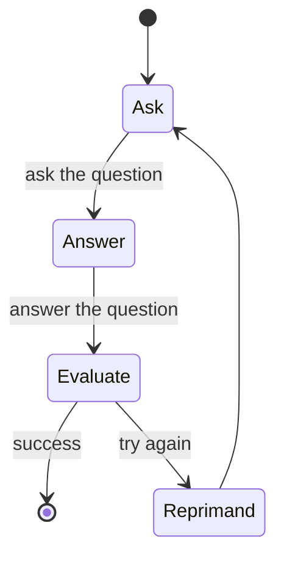

# PydanticAI Graphs & State Machines

## Overview

Graphs and finite state machines (FSMs) are powerful abstractions for modeling, executing, controlling, and visualizing complex workflows. Alongside PydanticAI, we've developed **pydantic-graph** — an async graph and state machine library for Python where nodes and edges are defined using type hints.

While developed as part of PydanticAI, **pydantic-graph** has no dependency on pydantic-ai and can be used as a pure graph-based state machine library, whether or not you're using PydanticAI or building with GenAI.

> **Note**: pydantic-graph is designed for advanced users and makes heavy use of Python generics and type hints. It is not designed to be as beginner-friendly as PydanticAI.

## Installation

```bash
# pydantic-graph is included with pydantic-ai
uv add pydantic-ai

# Or install directly
uv add pydantic-graph

# For slim installations
uv add pydantic-ai-slim  # optional dependency
```

## Core Components

### GraphRunContext

[`GraphRunContext`](src/graphs/context.py) holds the state of the graph and dependencies, similar to PydanticAI's [`RunContext`](src/context/run.py). It's passed to nodes when they're executed.

```python
from pydantic_graph import GraphRunContext

# Generic in the state type
ctx: GraphRunContext[MyState]
```

### End

[`End`](src/graphs/end.py) indicates the graph run should terminate and provides the final return value.

```python
from pydantic_graph import End

# Generic in the graph return type  
return End(42)  # End with integer result
return End("Complete")  # End with string result
```

### BaseNode

[`BaseNode`](src/graphs/nodes.py) subclasses define executable nodes in the graph. Nodes are typically dataclasses with:

- **Fields** containing parameters for the node
- **Business logic** in the [`run()`](src/graphs/nodes.py) method
- **Return annotations** that determine outgoing edges

```python
from dataclasses import dataclass
from pydantic_graph import BaseNode, GraphRunContext

@dataclass
class MyNode(BaseNode[MyState]):  # Generic in state type
    foo: int  # Node parameters
    
    async def run(
        self, 
        ctx: GraphRunContext[MyState],
    ) -> AnotherNode:  # Return type defines edges
        # Business logic here
        return AnotherNode()
```

#### Node Generic Parameters

Nodes are generic in three types:

1. **`StateT`** - State type (default: `None`)
2. **`DepsT`** - Dependencies type (default: `None`) 
3. **`RunEndT`** - Graph return type (default: `Never`, required if node returns `End`)

```python
@dataclass
class EndingNode(BaseNode[MyState, None, int]):  # Can return End[int]
    foo: int
    
    async def run(self, ctx: GraphRunContext[MyState]) -> AnotherNode | End[int]:
        if self.foo % 5 == 0:
            return End(self.foo)  # End the graph
        else:
            return AnotherNode()
```

### Graph

[`Graph`](src/graphs/graph.py) is the execution engine containing a set of node classes.

```python
from pydantic_graph import Graph

# Generic in state, deps, and return types
graph = Graph(nodes=[NodeA, NodeB, NodeC])

# Execute synchronously
result = graph.run_sync(StartNode())

# Execute asynchronously  
result = await graph.run(StartNode())
```

## Basic Graph Examples

### Simple Counter Graph

```python
from __future__ import annotations
from dataclasses import dataclass
from pydantic_graph import BaseNode, End, Graph, GraphRunContext

@dataclass
class DivisibleBy5(BaseNode[None, None, int]):
    foo: int

    async def run(
        self,
        ctx: GraphRunContext,
    ) -> Increment | End[int]:
        if self.foo % 5 == 0:
            return End(self.foo)
        else:
            return Increment(self.foo)

@dataclass
class Increment(BaseNode):
    foo: int

    async def run(self, ctx: GraphRunContext) -> DivisibleBy5:
        return DivisibleBy5(self.foo + 1)

# Create and run graph
fives_graph = Graph(nodes=[DivisibleBy5, Increment])
result = fives_graph.run_sync(DivisibleBy5(4))
print(result.output)  # 5
```

### Graph Visualization

Generate Mermaid diagrams for graph visualization:

```python
# Generate mermaid code
mermaid_code = fives_graph.mermaid_code(start_node=DivisibleBy5)

# Generate and save image
fives_graph.mermaid_image(start_node=DivisibleBy5)

# In Jupyter notebooks
from IPython.display import Image, display
display(Image(fives_graph.mermaid_image(start_node=DivisibleBy5)))
```

## Stateful Graphs

State provides a way to access and mutate objects as nodes run. Think of graphs as a production line where state is the engine being built up by each node.

### Vending Machine Example

```python
from __future__ import annotations
from dataclasses import dataclass
from rich.prompt import Prompt
from pydantic_graph import BaseNode, End, Graph, GraphRunContext

@dataclass
class MachineState:
    user_balance: float = 0.0
    product: str | None = None

@dataclass
class InsertCoin(BaseNode[MachineState]):
    async def run(self, ctx: GraphRunContext[MachineState]) -> CoinsInserted:
        return CoinsInserted(float(Prompt.ask('Insert coins')))

@dataclass
class CoinsInserted(BaseNode[MachineState]):
    amount: float

    async def run(
        self, ctx: GraphRunContext[MachineState]
    ) -> SelectProduct | Purchase:
        ctx.state.user_balance += self.amount  # Mutate state
        
        if ctx.state.product is not None:
            return Purchase(ctx.state.product)
        else:
            return SelectProduct()

@dataclass
class SelectProduct(BaseNode[MachineState]):
    async def run(self, ctx: GraphRunContext[MachineState]) -> Purchase:
        return Purchase(Prompt.ask('Select product'))

PRODUCT_PRICES = {
    'water': 1.25,
    'soda': 1.50,
    'crisps': 1.75,
    'chocolate': 2.00,
}

@dataclass
class Purchase(BaseNode[MachineState, None, None]):
    product: str

    async def run(
        self, ctx: GraphRunContext[MachineState]
    ) -> End | InsertCoin | SelectProduct:
        if price := PRODUCT_PRICES.get(self.product):
            ctx.state.product = self.product
            
            if ctx.state.user_balance >= price:
                ctx.state.user_balance -= price
                return End(None)
            else:
                diff = price - ctx.state.user_balance
                print(f'Not enough money for {self.product}, need {diff:0.2f} more')
                return InsertCoin()
        else:
            print(f'No such product: {self.product}, try again')
            return SelectProduct()

# Execute with state
vending_machine_graph = Graph(
    nodes=[InsertCoin, CoinsInserted, SelectProduct, Purchase]
)

async def main():
    state = MachineState()
    await vending_machine_graph.run(InsertCoin(), state=state)
    print(f'Purchase successful: item={state.product} change={state.user_balance:0.2f}')
```

## GenAI Integration

### Multi-Agent Email Workflow

```python
from __future__ import annotations
from dataclasses import dataclass, field
from pydantic import BaseModel, EmailStr
from pydantic_ai import Agent, format_as_xml
from pydantic_ai.messages import ModelMessage
from pydantic_graph import BaseNode, End, Graph, GraphRunContext

@dataclass
class User:
    name: str
    email: EmailStr
    interests: list[str]

@dataclass
class Email:
    subject: str
    body: str

@dataclass
class State:
    user: User
    write_agent_messages: list[ModelMessage] = field(default_factory=list)

# Email writing agent
email_writer_agent = Agent(
    'google-vertex:gemini-1.5-pro',
    output_type=Email,
    system_prompt='Write a welcome email to our tech blog.',
)

@dataclass
class WriteEmail(BaseNode[State]):
    email_feedback: str | None = None

    async def run(self, ctx: GraphRunContext[State]) -> Feedback:
        if self.email_feedback:
            prompt = (
                f'Rewrite the email for the user:\n'
                f'{format_as_xml(ctx.state.user)}\n'
                f'Feedback: {self.email_feedback}'
            )
        else:
            prompt = (
                f'Write a welcome email for the user:\n'
                f'{format_as_xml(ctx.state.user)}'
            )

        result = await email_writer_agent.run(
            prompt,
            message_history=ctx.state.write_agent_messages,
        )
        ctx.state.write_agent_messages += result.new_messages()
        return Feedback(result.output)

# Feedback evaluation models
class EmailRequiresWrite(BaseModel):
    feedback: str

class EmailOk(BaseModel):
    pass

# Feedback agent
feedback_agent = Agent[None, EmailRequiresWrite | EmailOk](
    'openai:gpt-4o',
    output_type=EmailRequiresWrite | EmailOk,  # type: ignore
    system_prompt=(
        'Review the email and provide feedback, '
        'email must reference the users specific interests.'
    ),
)

@dataclass
class Feedback(BaseNode[State, None, Email]):
    email: Email

    async def run(
        self,
        ctx: GraphRunContext[State],
    ) -> WriteEmail | End[Email]:
        prompt = format_as_xml({'user': ctx.state.user, 'email': self.email})
        result = await feedback_agent.run(prompt)
        
        if isinstance(result.output, EmailRequiresWrite):
            return WriteEmail(email_feedback=result.output.feedback)
        else:
            return End(self.email)

# Execute multi-agent workflow
async def main():
    user = User(
        name='John Doe',
        email='john.doe@example.com',
        interests=['Haskell', 'Lisp', 'Fortran'],
    )
    state = State(user)
    feedback_graph = Graph(nodes=(WriteEmail, Feedback))
    result = await feedback_graph.run(WriteEmail(), state=state)
    print(result.output)
    # Email(subject='Welcome to our tech blog!', body='Hello John, ...')
```

## Graph Iteration and Control

### Async Iteration

Use [`Graph.iter`](src/graphs/iteration.py) for direct control over graph execution:

```python
from dataclasses import dataclass
from pydantic_graph import Graph, BaseNode, End, GraphRunContext

@dataclass
class CountDownState:
    counter: int

@dataclass
class CountDown(BaseNode[CountDownState, None, int]):
    async def run(self, ctx: GraphRunContext[CountDownState]) -> CountDown | End[int]:
        if ctx.state.counter <= 0:
            return End(ctx.state.counter)
        ctx.state.counter -= 1
        return CountDown()

count_down_graph = Graph(nodes=[CountDown])

async def main():
    state = CountDownState(counter=3)
    async with count_down_graph.iter(CountDown(), state=state) as run:
        async for node in run:
            print('Node:', node)
            # Node: CountDown()
            # Node: CountDown() 
            # Node: CountDown()
            # Node: End(data=0)
    print('Final output:', run.result.output)  # 0
```

### Manual Node Control

Drive iteration manually with [`GraphRun.next()`](src/graphs/runner.py):

```python
async def manual_execution():
    state = CountDownState(counter=5)
    persistence = FullStatePersistence()
    
    async with count_down_graph.iter(
        CountDown(), state=state, persistence=persistence
    ) as run:
        node = run.next_node
        
        while not isinstance(node, End):
            print('Node:', node)
            if state.counter == 2:
                break  # Stop execution at specific condition
            node = await run.next(node)
        
        # Access execution history
        for step in persistence.history:
            print('History Step:', step.state)
```

## State Persistence

State persistence enables interrupted and resumed execution, crucial for:

- **Long-running workflows** that can't complete in a single run
- **Human-in-the-loop** processes requiring user input
- **Distributed execution** across multiple processes/machines

### Persistence Types

```python
from pydantic_graph import SimpleStatePersistence, FullStatePersistence
from pydantic_graph.persistence.file import FileStatePersistence

# Simple in-memory persistence (default)
persistence = SimpleStatePersistence()

# Full history persistence
persistence = FullStatePersistence()

# File-based persistence
persistence = FileStatePersistence(Path('graph_state.json'))
```

### Resumable Execution

```python
from pathlib import Path
from pydantic_graph.persistence.file import FileStatePersistence

async def resumable_workflow():
    run_id = 'run_abc123'
    persistence = FileStatePersistence(Path(f'count_down_{run_id}.json'))
    
    # Initialize if first run
    state = CountDownState(counter=5)
    await count_down_graph.initialize(
        CountDown(), state=state, persistence=persistence
    )
    
    # Execute node by node
    done = False
    while not done:
        done = await run_single_node(run_id)

async def run_single_node(run_id: str) -> bool:
    persistence = FileStatePersistence(Path(f'count_down_{run_id}.json'))
    
    async with count_down_graph.iter_from_persistence(persistence) as run:
        node_or_end = await run.next()
    
    print('Node:', node_or_end)
    return isinstance(node_or_end, End)
```

### Human-in-the-Loop Example

```python
import sys
from pathlib import Path
from pydantic_graph.persistence.file import FileStatePersistence

async def interactive_execution():
    answer: str | None = sys.argv[1] if len(sys.argv) > 1 else None
    persistence = FileStatePersistence(Path('question_graph.json'))
    persistence.set_graph_types(question_graph)
    
    if snapshot := await persistence.load_next():
        # Resume from persisted state
        state = snapshot.state
        assert answer is not None
        node = Evaluate(answer)
    else:
        # First run
        state = QuestionState()
        node = Ask()
    
    async with question_graph.iter(node, state=state, persistence=persistence) as run:
        while True:
            node = await run.next()
            
            if isinstance(node, End):
                print('END:', node.data)
                break
            elif isinstance(node, Answer):
                print(node.question)  # Wait for user input
                break
            # Continue for other node types
```

## Dependency Injection

Use dependency injection for external services, similar to PydanticAI:

```python
import asyncio
from concurrent.futures import ProcessPoolExecutor
from dataclasses import dataclass
from pydantic_graph import BaseNode, End, Graph, GraphRunContext

@dataclass
class GraphDeps:
    executor: ProcessPoolExecutor

@dataclass 
class DivisibleBy5(BaseNode[None, GraphDeps, int]):
    foo: int

    async def run(
        self,
        ctx: GraphRunContext[None, GraphDeps],
    ) -> Increment | End[int]:
        if self.foo % 5 == 0:
            return End(self.foo)
        else:
            return Increment(self.foo)

@dataclass
class Increment(BaseNode[None, GraphDeps]):
    foo: int

    async def run(self, ctx: GraphRunContext[None, GraphDeps]) -> DivisibleBy5:
        loop = asyncio.get_running_loop()
        compute_result = await loop.run_in_executor(
            ctx.deps.executor,
            self.compute,
        )
        return DivisibleBy5(compute_result)

    def compute(self) -> int:
        return self.foo + 1

# Execute with dependencies
async def main():
    with ProcessPoolExecutor() as executor:
        deps = GraphDeps(executor)
        result = await fives_graph.run(
            DivisibleBy5(3), 
            deps=deps, 
            persistence=FullStatePersistence()
        )
    print(result.output)  # 5
    print([item.node for item in result.persistence.history])
```

## Mermaid Diagram Generation

### Basic Diagram Generation

```python
# Generate mermaid code
mermaid_code = graph.mermaid_code(start_node=StartNode)

# Generate image from mermaid.ink
image_bytes = graph.mermaid_image(start_node=StartNode)

# Save diagram to file
graph.mermaid_save('diagram.png', start_node=StartNode)
```

### Enhanced Diagrams

```python
from typing import Annotated
from pydantic_graph import Edge

@dataclass
class Ask(BaseNode[QuestionState]):
    """Generate question using GPT-4o."""
    docstring_notes = True  # Include docstring in diagram
    
    async def run(
        self, ctx: GraphRunContext[QuestionState]
    ) -> Annotated[Answer, Edge(label='Ask the question')]:  # Labeled edge
        ...

@dataclass
class Evaluate(BaseNode[QuestionState]):
    answer: str

    async def run(
        self,
        ctx: GraphRunContext[QuestionState],
    ) -> Annotated[End[str], Edge(label='success')] | Reprimand:
        ...

# Generate with customizations
question_graph.mermaid_save(
    'enhanced_diagram.png',
    highlighted_nodes=[Answer],  # Highlight specific nodes
    direction='LR'  # Left-to-right flow
)
```

### Diagram Direction Options

```python
# Direction options for state diagrams
directions = {
    'TB': 'Top to bottom (default)',
    'LR': 'Left to right', 
    'RL': 'Right to left',
    'BT': 'Bottom to top'
}

# Use left-to-right layout
graph.mermaid_code(start_node=StartNode, direction='LR')
```

## Integration Patterns

### Database-Backed State Persistence

```python
from pydantic_graph.persistence.base import BaseStatePersistence
import asyncpg

class PostgresStatePersistence(BaseStatePersistence):
    def __init__(self, connection_string: str):
        self.connection_string = connection_string
    
    async def save_snapshot(self, snapshot):
        async with asyncpg.connect(self.connection_string) as conn:
            await conn.execute(
                "INSERT INTO graph_snapshots (run_id, data) VALUES ($1, $2)",
                snapshot.run_id, snapshot.json()
            )
    
    async def load_next(self):
        async with asyncpg.connect(self.connection_string) as conn:
            row = await conn.fetchrow(
                "SELECT data FROM graph_snapshots WHERE run_id = $1 ORDER BY created_at DESC LIMIT 1",
                self.run_id
            )
            return self.parse_snapshot(row['data']) if row else None
```

### Multi-Agent Orchestration

```python
@dataclass
class OrchestratorState:
    research_results: list[str] = field(default_factory=list)
    analysis_complete: bool = False
    final_report: str = ""

@dataclass
class ResearchAgent(BaseNode[OrchestratorState]):
    topic: str
    
    async def run(self, ctx: GraphRunContext[OrchestratorState]) -> AnalysisAgent:
        research_agent = Agent('openai:gpt-4o', system_prompt='Research specialist')
        result = await research_agent.run(f"Research {self.topic}")
        ctx.state.research_results.append(result.output)
        return AnalysisAgent()

@dataclass
class AnalysisAgent(BaseNode[OrchestratorState]):
    async def run(self, ctx: GraphRunContext[OrchestratorState]) -> ReportAgent | ResearchAgent:
        if len(ctx.state.research_results) >= 3:
            return ReportAgent()
        else:
            return ResearchAgent(topic="additional research needed")

@dataclass
class ReportAgent(BaseNode[OrchestratorState, None, str]):
    async def run(self, ctx: GraphRunContext[OrchestratorState]) -> End[str]:
        report_agent = Agent('openai:gpt-4o', system_prompt='Report writer')
        result = await report_agent.run(
            f"Create report from: {ctx.state.research_results}"
        )
        return End(result.output)
```

### Error Handling and Recovery

```python
from pydantic_graph.exceptions import GraphExecutionError

@dataclass
class RobustNode(BaseNode[State]):
    retry_count: int = 0
    max_retries: int = 3
    
    async def run(self, ctx: GraphRunContext[State]) -> NextNode | RetryNode | ErrorNode:
        try:
            # Potentially failing operation
            result = await risky_operation()
            return NextNode(result)
        except Exception as e:
            if self.retry_count < self.max_retries:
                return RetryNode(
                    retry_count=self.retry_count + 1,
                    error=str(e)
                )
            else:
                return ErrorNode(f"Failed after {self.max_retries} retries: {e}")
```

## Best Practices

### Graph Design

1. **Keep nodes focused** - Single responsibility per node
2. **Use state judiciously** - Don't store everything in state
3. **Plan for persistence** - Design for resumable execution
4. **Leverage type hints** - Enable static analysis and validation

### Performance Optimization

1. **Minimize state size** - Large states slow persistence
2. **Use appropriate persistence** - File-based for development, database for production
3. **Consider parallel execution** - Plan for future parallel node support
4. **Monitor execution paths** - Use diagrams to optimize flow

### Error Handling

1. **Plan for failures** - Design recovery paths
2. **Use structured logging** - Track execution through complex graphs
3. **Implement circuit breakers** - Prevent cascade failures
4. **Test edge cases** - Cover all possible node transitions

### Testing Strategies

1. **Unit test nodes** - Test node logic independently
2. **Integration test graphs** - Test complete workflows
3. **Mock external dependencies** - Use dependency injection for testing
4. **Test persistence** - Verify resumable execution

## Related Documentation

- [`🛠️ Agents & Tools`](pydantic_ai_agents.md) - Agent integration with graphs
- [`🧪 Unit Testing Guide`](pydantic_ai_testing.md) - Testing graph workflows
- [`📤 Output Handling`](pydantic_ai_output.md) - Agent outputs in graph nodes
- [`🔍 Observability`](pydantic_ai_observability.md) - Monitoring graph execution
- [`💻 API Documentation`](pydantic_ai_api.md) - HTTP APIs for graph workflows
## Complete Real-World Example: Question Graph

This comprehensive example demonstrates the full power of pydantic-graph with a question-answer evaluation workflow featuring human interaction, state persistence, and multi-agent coordination.

### Features Demonstrated

- **Multi-Agent Coordination**: Question generation and answer evaluation agents
- **Human-in-the-Loop**: User input collection with resumable execution  
- **State Persistence**: File-based persistence with resume capability
- **Observability Integration**: Logfire instrumentation for monitoring
- **CLI Interface**: Multiple execution modes for different use cases

### Complete Implementation

```python
from __future__ import annotations as _annotations
from dataclasses import dataclass, field
from pathlib import Path
import logfire
from pydantic import BaseModel
from pydantic_graph import (
    BaseNode, End, Graph, GraphRunContext,
)
from pydantic_graph.persistence.file import FileStatePersistence
from pydantic_ai import Agent, format_as_xml
from pydantic_ai.messages import ModelMessage

# Configure observability
logfire.configure(send_to_logfire='if-token-present')
logfire.instrument_pydantic_ai()

# Question generation agent
ask_agent = Agent('openai:gpt-4o', output_type=str)

@dataclass
class QuestionState:
    question: str | None = None
    ask_agent_messages: list[ModelMessage] = field(default_factory=list)
    evaluate_agent_messages: list[ModelMessage] = field(default_factory=list)

@dataclass
class Ask(BaseNode[QuestionState]):
    """Generate question using GPT-4o."""
    
    async def run(self, ctx: GraphRunContext[QuestionState]) -> Answer:
        result = await ask_agent.run(
            'Ask a simple question with a single correct answer.',
            message_history=ctx.state.ask_agent_messages,
        )
        ctx.state.ask_agent_messages += result.all_messages()
        ctx.state.question = result.output
        return Answer(result.output)

@dataclass
class Answer(BaseNode[QuestionState]):
    """Human input collection node."""
    question: str

    async def run(self, ctx: GraphRunContext[QuestionState]) -> Evaluate:
        answer = input(f'{self.question}: ')
        return Evaluate(answer)

class EvaluationOutput(BaseModel, use_attribute_docstrings=True):
    correct: bool
    """Whether the answer is correct."""
    comment: str
    """Comment on the answer, reprimand the user if wrong."""

# Answer evaluation agent
evaluate_agent = Agent(
    'openai:gpt-4o',
    output_type=EvaluationOutput,
    system_prompt='Given a question and answer, evaluate if the answer is correct.',
)

@dataclass
class Evaluate(BaseNode[QuestionState, None, str]):
    """Evaluate the user's answer."""
    answer: str

    async def run(
        self,
        ctx: GraphRunContext[QuestionState],
    ) -> End[str] | Reprimand:
        assert ctx.state.question is not None
        result = await evaluate_agent.run(
            format_as_xml({'question': ctx.state.question, 'answer': self.answer}),
            message_history=ctx.state.evaluate_agent_messages,
        )
        ctx.state.evaluate_agent_messages += result.all_messages()
        
        if result.output.correct:
            return End(result.output.comment)  # Success
        else:
            return Reprimand(result.output.comment)  # Try again

@dataclass
class Reprimand(BaseNode[QuestionState]):
    """Provide feedback and restart the process."""
    comment: str

    async def run(self, ctx: GraphRunContext[QuestionState]) -> Ask:
        print(f'Comment: {self.comment}')
        ctx.state.question = None
        return Ask()

# Create the graph
question_graph = Graph(
    nodes=(Ask, Answer, Evaluate, Reprimand), 
    state_type=QuestionState
)

# Continuous execution mode
async def run_as_continuous():
    """Run the entire graph continuously until completion."""
    state = QuestionState()
    node = Ask()
    end = await question_graph.run(node, state=state)
    print('END:', end.output)

# CLI mode with persistence
async def run_as_cli(answer: str | None):
    """Run with file persistence, allowing resumption."""
    persistence = FileStatePersistence(Path('question_graph.json'))
    persistence.set_graph_types(question_graph)

    if snapshot := await persistence.load_next():
        # Resume from persisted state
        state = snapshot.state
        assert answer is not None, 'Answer required for resumed execution'
        node = Evaluate(answer)
    else:
        # First run
        state = QuestionState()
        node = Ask()

    async with question_graph.iter(node, state=state, persistence=persistence) as run:
        while True:
            node = await run.next()
            
            if isinstance(node, End):
                print('END:', node.data)
                history = await persistence.load_all()
                print('History:', '\n'.join(str(e.node) for e in history), sep='\n')
                print('Finished!')
                break
            elif isinstance(node, Answer):
                print(node.question)  # Display question and wait for CLI input
                break
            # Continue for other node types

# Command-line interface
if __name__ == '__main__':
    import asyncio
    import sys

    try:
        sub_command = sys.argv[1]
        assert sub_command in ('continuous', 'cli', 'mermaid')
    except (IndexError, AssertionError):
        print(
            'Usage:\n'
            '  python question_graph.py mermaid\n'
            'or:\n'
            '  python question_graph.py continuous\n'
            'or:\n'
            '  python question_graph.py cli [answer]',
            file=sys.stderr,
        )
        sys.exit(1)

    if sub_command == 'mermaid':
        print(question_graph.mermaid_code(start_node=Ask))
    elif sub_command == 'continuous':
        asyncio.run(run_as_continuous())
    else:
        a = sys.argv[2] if len(sys.argv) > 2 else None
        asyncio.run(run_as_cli(a))
```

### Usage Examples

```bash
# Generate mermaid diagram
python question_graph.py mermaid

# Run continuously (no persistence)
python question_graph.py continuous

# Run with CLI persistence (first time)
python question_graph.py cli

# Resume with answer
python question_graph.py cli "Paris"
```

### Generated Mermaid Diagram

The graph visualization shows the complete workflow:



This demonstrates:
- **Question Generation**: AI agent creates questions
- **Human Interaction**: User provides answers
- **Answer Evaluation**: AI judges correctness
- **Feedback Loop**: Incorrect answers restart the process
- **Success Termination**: Correct answers end the workflow