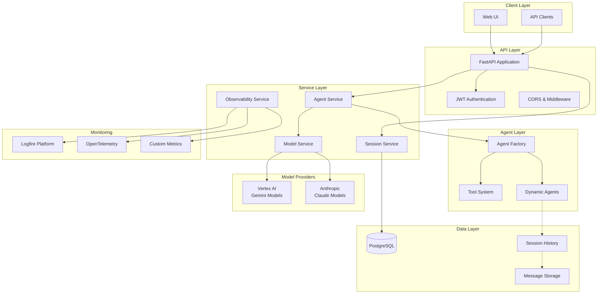

# 🤖 Pydantic AI Agents Service - Implementation Guide

> **Complete, production-ready Pydantic AI agents service implementation using official API patterns**

## 📚 Documentation Index

This implementation guide is broken down into focused, modular documentation files:

### 🏗️ **Core Architecture**
- **[📊 Observability & Monitoring](./pydantic_ai_observability.md)** - OpenTelemetry, Logfire, and monitoring setup
- **[🗄️ Database Schema](./pydantic_ai_database.md)** - PostgreSQL models and relationships
- **[🤖 Model Service](./pydantic_ai_models.md)** - Vertex AI and Anthropic integration
- **[🔧 Agent System](./pydantic_ai_agents.md)** - Dynamic agent creation and tool system
- **[🕸️ Graphs & State Machines](./pydantic_ai_graphs.md)** - Complex workflow orchestration with pydantic-graph

### 💬 **Conversation Management**
- **[💬 Session & Messages](./pydantic_ai_sessions.md)** - Conversation history and message handling
- **[📤 Output Handling](./pydantic_ai_output.md)** - Structured outputs, streaming, and validation
- **[🎨 Multimodal Input](./pydantic_ai_multimodal.md)** - Image, audio, video, and document support
- **[🌐 API Endpoints](./pydantic_ai_api.md)** - FastAPI routes and schemas

### 🧪 **Testing & Evaluation**
- **[🧪 Unit Testing Guide](./pydantic_ai_testing.md)** - Comprehensive testing with TestModel and FunctionModel
- **[🧪 Pydantic Evals](./pydantic_ai_evals.md)** - Model evaluation, testing, and benchmarking

### 🚀 **Deployment & Operations**
- **[🚀 Deployment Guide](./pydantic_ai_deployment.md)** - Docker, environments, and production setup
- **[📝 Code Templates](./pydantic_ai_templates.md)** - Ready-to-use code snippets

## 🎯 **Quick Start**

1. **[Setup Foundation](./pydantic_ai_deployment.md#foundation-setup)** - UV workspace and dependencies
2. **[Configure Database](./pydantic_ai_database.md#setup)** - PostgreSQL schema and migrations
3. **[Setup Models](./pydantic_ai_models.md#vertex-ai-setup)** - Vertex AI and Anthropic configuration
4. **[Create Agents](./pydantic_ai_agents.md#dynamic-creation)** - Dynamic agent system
5. **[Add Observability](./pydantic_ai_observability.md#production-setup)** - Monitoring and instrumentation
6. **[Deploy](./pydantic_ai_deployment.md#docker-deployment)** - Production deployment

## ✅ **Key Features Implemented**

**🔄 Official Pydantic AI Integration:**
- ✅ `GoogleProvider(vertexai=True)` for Gemini models
- ✅ `AnthropicProvider` for Claude models
- ✅ `agent.run()` and `agent.run_stream()` execution
- ✅ `@agent.tool` and `@agent.tool_plain` decorators
- ✅ `result.all_messages()` and `message_history` parameter

**💾 Conversation Management:**
- ✅ Persistent message history with `ModelMessagesTypeAdapter`
- ✅ Streaming responses with `result.stream_text()`
- ✅ Cost tracking with `result.cost()`
- ✅ Session management across multiple turns

**🎨 Multimodal Input Support:**
- ✅ Image processing with `ImageUrl` and `BinaryContent`
- ✅ Audio input with `AudioUrl` and binary audio data
- ✅ Video processing with `VideoUrl` and binary video data
- ✅ Document handling with `DocumentUrl` and binary documents
- ✅ Multimodal agent tools and content processing

**🔗 Agent Interoperability:**
- ✅ Agent2Agent (A2A) Protocol support with `agent.to_a2a()`
- ✅ FastA2A integration for cross-framework communication
- ✅ ASGI-compatible agent servers
- ✅ Multi-agent orchestration capabilities

**🧪 Model Evaluation & Testing:**
- ✅ Pydantic Evals framework for systematic testing
- ✅ Dataset and Case management for evaluation scenarios
- ✅ Built-in evaluators (IsInstance, LLMJudge, EqualsExpected)
- ✅ Custom evaluator creation and scoring
- ✅ Parallel evaluation with concurrency control
- ✅ OpenTelemetry integration for evaluation tracing
- ✅ Dataset generation and YAML/JSON export
- ✅ Logfire integration for evaluation visualization

**📊 Production Monitoring:**
- ✅ OpenTelemetry instrumentation with `logfire.instrument_pydantic_ai()`
- ✅ Multiple backend support (Logfire, Jaeger, custom OTel)
- ✅ Performance and cost analytics
- ✅ Error tracking and debugging

**🕸️ Workflow Orchestration:**
- ✅ Graph-based state machines with pydantic-graph
- ✅ Complex workflow modeling and execution
- ✅ State persistence for resumable workflows
- ✅ Human-in-the-loop processes
- ✅ Multi-agent orchestration patterns
- ✅ Mermaid diagram generation for workflow visualization

**🏭 Enterprise Features:**
- ✅ Dynamic agent creation and management
- ✅ User authentication and authorization
- ✅ Agent marketplace with sharing
- ✅ Tool system with file operations
- ✅ Multi-tenant architecture

## 🏛️ **Architecture Overview**

## 📋 **Implementation Status**

| Component | Status | Documentation |
|-----------|--------|---------------|
| Database Schema | ✅ Complete | [Database Guide](./pydantic_ai_database.md) |
| Model Integration | ✅ Complete | [Model Service](./pydantic_ai_models.md) |
| Agent System | ✅ Complete | [Agent System](./pydantic_ai_agents.md) |
| Session Management | ✅ Complete | [Sessions & Messages](./pydantic_ai_sessions.md) |
| API Endpoints | ✅ Complete | [API Guide](./pydantic_ai_api.md) |
| Multimodal Support | ✅ Complete | [Multimodal Input](./pydantic_ai_multimodal.md) |
| Evaluation Framework | ✅ Complete | [Pydantic Evals](./pydantic_ai_evals.md) |
| Observability | ✅ Complete | [Monitoring Guide](./pydantic_ai_observability.md) |
| Deployment | ✅ Complete | [Deployment Guide](./pydantic_ai_deployment.md) |
| Code Templates | ✅ Complete | [Code Templates](./pydantic_ai_templates.md) |

## 🔗 **External Resources**

- **[Pydantic AI Documentation](https://docs.pydantic.ai/)** - Official Pydantic AI docs
- **[Logfire Platform](https://logfire.pydantic.dev/)** - Observability platform
- **[Google Vertex AI](https://cloud.google.com/vertex-ai)** - Gemini models
- **[Anthropic API](https://docs.anthropic.com/)** - Claude models
- **[FastAPI Documentation](https://fastapi.tiangolo.com/)** - Web framework
- **[OpenTelemetry](https://opentelemetry.io/)** - Observability framework

---

*This implementation guide provides complete, validated patterns for building production-ready Pydantic AI agents services.*